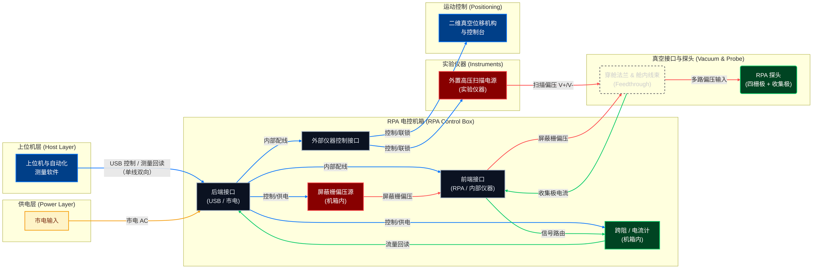

# 等离子体探针系统工程工作台

面向等离子体探针及其后端电路的定制化制造项目，使用 React + Node.js (Express) 构建统一的系统工程工作台。在设计阶段即可同步功能分解、物理分解、系统/子系统需求以及物料清单（BOM），让工程、工艺与采购团队共享同一份实时数据。

## 功能概览

- **功能/物理分解**：记录每支探针、偏压控制、后电路、结构件等的分解树，说明关键活动与约束。
- **系统/子系统需求**：统一存放客户验收指标、后电路性能约束、维护性要求等，并为每条需求指定验证方式、责任团队与优先级。
- **BOM 视图**：列出探针杆、线束、PCB 等关键物料、数量、供应商与备注，为采购/制造做准备。
- **中英混合数据支持**：后端 API 仍使用 REST/JSON，前端界面完整中文化，方便面向国内客户的沟通。
- **AI 驱动**：本工具被设计为由上层 AI/自动化系统写入、维护数据，人工用户仅进行浏览与复核。为保证轨迹一致性，前端未提供手动新增/删除项目的入口，API 仅建议由可信的 AI 代理或集成脚本调用。
- **实时同步**：前端每 5 秒轮询一次 `/projects`，任何 JSON 或脚本的改动都会即时同步；再配合 Vite dev server 热重载，开发体验接近“所见即所得”。
- **项目隔离**：每个工程项目有独立的数据文件、变更日志与前端页面（含专属系统图/布局），互不共享 UI 状态或资源，避免串改。

> **设计理念**  
> - 项目信息（分解、需求、BOM）由 AI 生成并同步，避免人工手改导致失真。  
> - 工程师的主要操作是查看、导出和复核，不手动输入。  
> - 如确需导入旧项目，应通过自动化脚本一次性写入 JSON 或调用 API。

## 目录结构

```
backend/        Node.js (Express)，负责数据模型与接口
frontend/       Vite + React (TypeScript) 客户端
notes/          仍保留 NASA Handbook 学习笔记，供参考
```

## 数据存储与变更记录（每项目独立文件）
- 后端数据目录：`backend/data/`（已加入 `.gitignore`，不会提交仓库）。
- 每个项目对应一个 JSON：`backend/data/<projectId>.json`，结构与 API 返回体一致。
- 每个项目有独立 TXT 变更记录：`backend/data/<projectId>.log`，每次通过 API 增删改项目/需求都会追加一行时间戳和动作（如 `UPDATE project rpa-probe fields: summary, tags`）。
- 下载变更记录：前端项目详情页提供“下载项目变更记录 (txt)”按钮，或直接调用 API：`GET /projects/:projectId/log`（`Content-Disposition: attachment`）。
- 删除项目时，JSON 与 log 会同时被移除。
- 兼容历史：如仍有旧的聚合文件 `backend/data/projects.json`，服务启动时会自动拆分成独立的 `<id>.json` 并将原文件转存为 `projects.legacy.json`，避免多个项目共用同一存储造成互相覆盖。

## Mermaid 系统图编写与校对指南（给 AI 的操作指引，>=1000 字）

本工程的系统图使用 Mermaid v10（已安装为依赖 `mermaid`），通过通用组件渲染。以下规则面向 AI/自动化代理，帮助在不引入歧义的前提下稳定生成可审计的图形代码。所有生成动作请遵守本节约束，避免随意改动颜色、布局或链路语义。

### 1. 文件与组件入口
- 渲染组件：`frontend/src/components/MermaidChart.tsx`，内部用 `mermaid.render`，配置 `startOnLoad:false`、`theme:'dark'`。渲染前会清空容器，防止重复叠加。
- 系统图代码：`frontend/src/pages/rpa-probe.tsx` 中的 `const rpaProbeDiagram = \`...\``（如需新增项目图，请在对应页面文件中添加独立字符串并注册）。修改后即刻生效。
- 样式：`frontend/src/App.css` 的 `.mermaid-chart` 块。当前设置无滚动条，宽度自适应，字体由 Mermaid init 的 `themeVariables.fontSize` 控制。

### 2. 初始化模板（必须保留）
在图字符串首行使用 init 块，锁定字体与间距，并允许曲线：
```mermaid
%%{init: { "flowchart": { "useMaxWidth": false, "nodeSpacing": 50, "rankSpacing": 80, "curve": "basis", "htmlLabels": true }, "themeVariables": { "fontSize": "18px" } } }%%
graph LR
```
- `useMaxWidth:false` 防止被强制压缩。
- `curve:"basis"` 允许柔和曲线（已按要求回滚直角线）。如需直角线，可改为 `"stepAfter"`，但需显式说明原因。
- `htmlLabels:true` 允许 `<br/>` 分行，便于双语标签。

### 3. 固定分层与节点命名
按下列分组声明，名称与职责不可随意改写，只允许调整描述文字或换行。
- Host：`PC["上位机与自动化<br/>测量软件"]`，类 `usb`。
  - Power：`Mains["市电输入"]`，类 `mains`。
  - Instruments：`ExtPS["外置高压扫描电源<br/>(实验仪器)"]`，类 `hv`。
  - RPABox：包含
    - `BackIface["后端接口<br/>(USB / 市电)"]`（类 `iface`）
    - `FrontIface["前端接口<br/>(RPA / 内部仪器)"]`（类 `iface`）
    - `ExtCtrlIface["外部仪器控制接口"]`（类 `iface`）
    - `GroundIface["接地接口"]`（类 `iface`）
    - `BiasSource["屏蔽栅偏压源<br/>(机箱内)"]`（类 `hv`）
    - `Ammeter["跨阻 / 电流计<br/>(机箱内)"]`（类 `signal`）
  - Vacuum：`Flange("穿舱法兰 & 舱内线束<br/>(Feedthrough)")`（类 `box`），`Probe("RPA 探头<br/>(四栅极 + 收集极)")`（类 `signal`），`VacuumChamber["真空舱体模块"]`（类 `box`）。
  - Motion：`MotionCtrl["二维真空位移机构<br/>与控制台"]`（类 `usb`，实际为控制接口颜色）。

### 4. classDef（颜色固定，不要自创）
```mermaid
classDef usb stroke:#0075ff,stroke-width:2px,color:white,fill:#003f88;
classDef hv stroke:#ff4d4d,stroke-width:2px,color:white,fill:#880000;
classDef signal stroke:#00cc66,stroke-width:2px,color:white,fill:#004422;
classDef box stroke:#666,stroke-width:2px,stroke-dasharray: 5 5,fill:none,color:#ccc;
classDef iface stroke:#94a3b8,stroke-width:2px,color:#e2e8f0,fill:#0b1221;
classDef mains stroke:#f59e0b,stroke-width:2px,color:#7c2d12,fill:#fef3c7;
```
仅在确有新语义时才增补 classDef，并同步写入 README。

### 5. 连线逻辑（必须保持的一致性）
- 后端接口：`PC == "USB 控制 / 测量回读（单线双向）" ==> BackIface`；`Mains -- "市电 AC" --> BackIface`。
- 机箱内部：`BackIface -- "控制/供电" --> BiasSource`，`BackIface -- "控制/供电" --> Ammeter`，`BackIface -- "内部配线" --> FrontIface`，`BackIface -- "内部配线" --> ExtCtrlIface`。
- 外部仪器控制接口：`ExtCtrlIface == "控制/联锁" ==> MotionCtrl`，`ExtCtrlIface == "控制/联锁" ==> ExtPS`。
- 接地与前端接口：`BiasSource -- "屏蔽栅正极接地" --> GroundIface`；`BiasSource -- "屏蔽栅偏压" --> FrontIface`；`FrontIface -- "屏蔽栅偏压" --> Flange`；`ExtPS -- "扫描偏压 V+/V-" --> Flange`；`ExtPS -- "接地" --> VacuumChamber`；`Flange -- "多路偏压输入" --> Probe`；`GroundIface -- "接地" --> VacuumChamber`。
- 信号路径：`Flange -- "收集极电流" --> FrontIface`，`FrontIface -- "信号路由" --> Ammeter`，`Ammeter -- "流量回读" --> BackIface`。
- 运动链路已改为经电控箱转发，禁止上位机直连 MotionCtrl。

### 6. linkStyle（索引顺序不可乱）
连接声明的顺序决定索引。当前顺序对应：
```mermaid
linkStyle 0,2,3,4,5,6,7 stroke:#0075ff,stroke-width:2px;  %% USB/控制类
linkStyle 1 stroke:#f59e0b,stroke-width:2px;               %% AC 市电
linkStyle 9,10,11,13 stroke:#ff4d4d,stroke-width:2px;      %% 高压/偏压
linkStyle 8,12,14,15,16,17 stroke:#00cc66,stroke-width:2px;   %% 接地/信号回读
```
若新增连线，需重算索引并更新 README 说明，保持颜色语义一致（蓝=控制/通信，橙=AC，红=高压偏压，绿=信号/接地）。

### 7. 标签与文案规范
- 标签尽量短，必要时用 `<br/>` 分行。
- 双语写法采用中文主体 + 英文补充，如 “外置高压扫描电源<br/>(实验仪器)”。
- 控制/测量回路强调“单线双向”或“控制/联锁”，避免模糊。
- 真实物理路径要与业务描述一致：ExtPS 不经过电控箱，仅经外部仪器控制接口获得控制/联锁信号，偏压直接到穿舱线束。

### 8. 校验清单（AI 出图前后自检）
1) 节点分组齐全：Host/Power/Instruments/RPABox/Vacuum/Motion。  
2) 线序与 `linkStyle` 索引对应，颜色语义正确。  
3) 没有新增 classDef 未在 README 备案。  
4) 没有把上位机直接连到 MotionCtrl，控制需经 ExtCtrlIface。  
5) ExtPS 只接收控制/联锁，偏压输出直达 Flange，再到 Probe。  
6) 字体、间距 init 块未删除，curve 使用 `basis`。  
7) Mermaid 代码包裹在模板字符串 `rpaDiagram`，未引入额外反引号或缩进错误。  
8) 运行 `cd frontend && npm run build` 确认通过（Mermaid 体积告警可忽略）。

### 9. 常见错误及处理
- **线条颜色错乱**：检查 linkStyle 索引与声明顺序，必要时重新编号并在 README 更新说明。
- **滚动条出现或图被压缩**：确保 CSS `overflow:hidden` 未被改动；init 中 `useMaxWidth:false` 保留；不要手动设置 SVG 固定宽度。
- **文字太挤**：优先使用 `<br/>` 分行，次选调整 `nodeSpacing`/`rankSpacing`，不建议加长标签导致节点溢出。
- **控制链路遗漏**：运动控制必须经 ExtCtrlIface；USB 单线双向需保留文案，不能拆成两条。
- **新增物理部件**：若确需新节点，先在本 README 记录用途、样式和连线颜色，再修改 `rpaDiagram`，保持分层清晰。

### 10. 参考片段（当前权威版本）


只要遵循上述模板，AI 生成的 Mermaid 代码即可稳定复用现有样式与链路，不会破坏图例语义。

## 后端运行

```bash
cd backend
npm install
node server.js --host 127.0.0.1 --port 8001
```

前端使用 Vite dev server：

```bash
cd frontend
npm install
VITE_API_BASE_URL=http://127.0.0.1:8001 npm run dev -- --host 127.0.0.1 --port 5173
```

界面会自动轮询 `/projects`，无需手动刷新即可看到最新 JSON 更改。若需要局域网访问，可把后端 `--host` 改为 `0.0.0.0`，但浏览器仍需输入 `http://localhost:<端口>` 或实际 IP。
- JSON 数据默认保存在 `backend/data/projects.json`。可直接编辑或换成数据库。
- 常用接口：
  - `GET /projects`：列出所有项目（含分解、需求、BOM）。
  - `GET /projects/{id}`：查看单个项目。
  - `POST /projects/{id}/requirements`：新增需求（`scope` 字段区分系统/子系统）。
  - `PUT /projects/{id}/requirements/{req_id}`、`DELETE ...`：维护需求。
- **禁用手工操作**：不建议人工直接调用 `POST /projects` 等接口增删项目；这些接口只供 AI 管道或自动化脚本批量写入。若需人工调整，请更新源 JSON 并通过脚本整体刷新。

## 启动脚本（Windows PowerShell）

```
.\start.ps1                                # 启动 Node 后端 + Vite dev server
.\start.ps1 -Port 9000 -FrontendPort 5200  # 自定义后端/前端端口
.\start.ps1 -BindHost 0.0.0.0 -NoWait      # 对外开放并后台运行
```

## 部署（SSH，默认后端端口 3002）

在本地 PowerShell 运行（需 npm 可用，服务器需 Node/npm 环境）：
```powershell
powershell -ExecutionPolicy Bypass -File .\deploy_syseng.ps1 `
  -ServerHost <你的服务器IP> `
  -ServerUser root `
  -ApiPort 3002
# 如需密码自动化：添加 -SshPass "你的密码"（本机需安装 sshpass）
```
脚本流程：本地前端 build → 打包上传到 `/www/wwwroot/SysEng` → 服务器 npm 安装 backend 依赖 → pm2 以 3002 端口运行 Node 服务。

脚本会设置 `VITE_API_BASE_URL=http://<BindHost>:<Port>` 后依次启动后端（`node backend/server.js`）和前端 dev server（默认 `http://127.0.0.1:5173`）。退出时两个进程都会被清理。由于界面自带轮询，因此只需更新 `backend/data/projects.json` 或调用 API，页面将在 5 秒内自动刷新数据。

## 下一步可扩展方向

1. 将 JSON 存储替换为数据库，并接入登录/权限，细分客户项目访问。
2. 在需求上挂接验证/测试报告的附件或链接，实现全流程溯源。
3. 根据制造状态自动生成批次化 BOM 和工艺指令，进一步打通 ERP。
